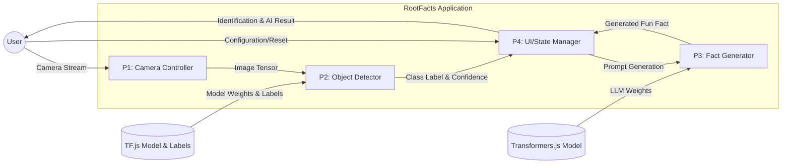
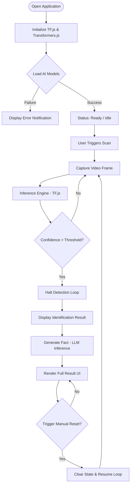
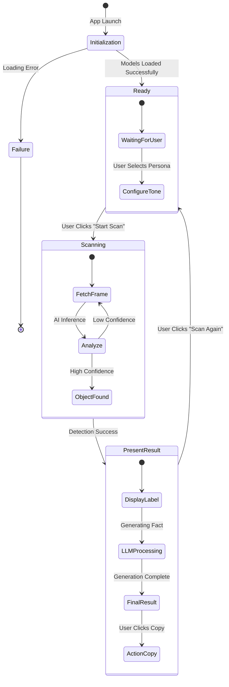

# System Architecture Documentation - RootFacts

Dokumen ini menyajikan arsitektur teknis dan logika bisnis dari aplikasi RootFacts, mencakup aliran data, kontrol proses, dan mekanisme integrasi AI.

---

## 1. System Visualizations

### Data Flow Diagram (DFD) Level 1

The following diagram illustrates the data flow from the hardware interface to the AI inference engines.



### System Flowchart

This flowchart defines the operational logic from application initialization to result output.



### Activity Diagram

A sequential representation of the interactions between the User and the RootFacts System.



---

## 2. Core Business Logic Explanation

Berikut adalah penjelasan teknis mengenai logika bisnis utama yang diimplementasikan dalam sistem RootFacts.

### A. Adaptive AI Initialization

Sistem secara otomatis mendeteksi kapabilitas perangkat keras untuk memilih backend pemrosesan terbaik. Prioritas diberikan kepada **WebGPU** untuk efisiensi tinggi, dengan fallback ke **WebGL** atau **CPU**.

```javascript
// Logic for adaptive backend selection
if (navigator.gpu) {
  await tf.setBackend('webgpu'); // Primary: High-performance GPU processing
} else {
  await tf.setBackend('webgl'); // Secondary: Hardware acceleration fallback
}
```

### B. High-Precision Object Detection

Proses deteksi melibatkan transformasi citra menjadi tensor (224x224 pixel) yang dinormalisasi sebelum dikirim ke mesin inferensi TensorFlow.js.

```javascript
// Image-to-Tensor transformation and prediction
const tensor = tf.browser
  .fromPixels(videoElement)
  .resizeNearestNeighbor([224, 224])
  .toFloat()
  .div(127.5)
  .sub(1); // Normalization

const prediction = model.predict(tensor);
```

### C. Generative AI Persona Engine

Sistem menggunakan modul Transformers.js untuk melakukan _Natural Language Generation_ secara lokal. Konten fakta disesuaikan secara dinamis berdasarkan parameter gaya bahasa (_Tone_) yang dipilih pengguna.

```javascript
// Dynamic prompt engineering for LLM
const prompt = `Provide a ${selectedTone} fact about the vegetable: ${vegetableName}.`;
const result = await generator(prompt, { max_new_tokens: 128 });
```

### D. PWA & Offline Optimization

Untuk memenuhi kriteria akses luring, sistem menerapkan strategi _Precaching_ pada Service Worker. Berkas model AI yang berukuran besar dikelola melalui konfigurasi Workbox dengan limitasi ukuran file yang telah dioptimalkan.

```javascript
// PWA configuration for local asset persistence
workbox: {
  maximumFileSizeToCacheInBytes: 5 * 1024 * 1024, // Optimized for 5MB assets
  globPatterns: ['**/*.{json,bin,js,css,html}'], // Persistence for AI weights
}
```

---

> [!NOTE]
> Seluruh proses inferensi dilakukan pada sisi klien (_client-side_), memastikan kedaulatan data pengguna dan responsivitas aplikasi tanpa ketergantungan pada API eksternal setelah pemuatan awal.
